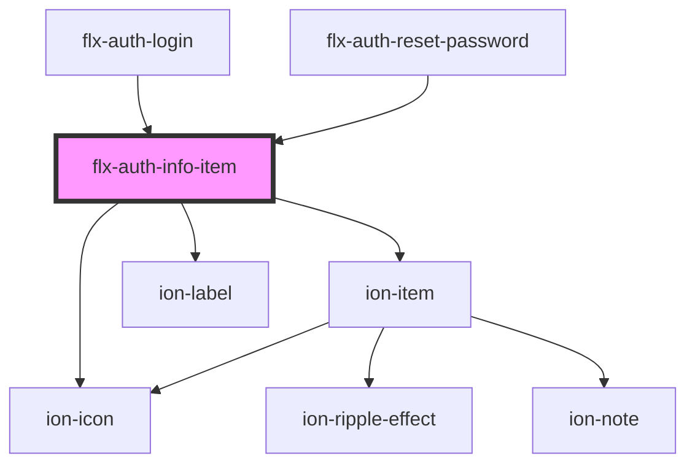

# flx-auth-info-item

<!-- Auto Generated Below -->

## Properties

| Property | Attribute | Description | Type                                                                                                                         | Default     |
| -------- | --------- | ----------- | ---------------------------------------------------------------------------------------------------------------------------- | ----------- |
| `color`  | `color`   |             | `"danger" \| "dark" \| "light" \| "medium" \| "primary" \| "secondary" \| "success" \| "tertiary" \| "warning" \| undefined` | `undefined` |
| `icon`   | `icon`    |             | `string \| undefined`                                                                                                        | `undefined` |
| `infos`  | --        |             | `string[]`                                                                                                                   | `[]`        |

## Dependencies

### Used by

 - [flx-auth-login](../login)
 - [flx-auth-reset-password](../reset-password)

### Depends on

- ion-item
- ion-icon
- ion-label

### Graph

----------------------------------------------

*Built with [StencilJS](https://stenciljs.com/)*
