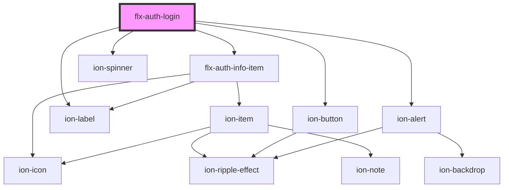

# auth-login

<!-- Auto Generated Below -->

## Properties

| Property | Attribute | Description | Type                                                                                                                                                                                                                                                                                                                                                                                     | Default |
| -------- | --------- | ----------- | ---------------------------------------------------------------------------------------------------------------------------------------------------------------------------------------------------------------------------------------------------------------------------------------------------------------------------------------------------------------------------------------- | ------- |
| `i18n`   | --        |             | `{ login: string; identifier: { label: string; errors: { required: string; minlen: string; email: string; exists: string; identical: string; noaccountfound: string; notvalid: string; }; }; password: { label: string; forgot: string; errors: { required: string; minlen: string; email: string; exists: string; identical: string; noaccountfound: string; notvalid: string; }; }; }` | `i18n`  |
| `mode`   | `mode`    |             | `"ios" \| "md"`                                                                                                                                                                                                                                                                                                                                                                          | `"md"`  |

## Events

| Event           | Description | Type               |
| --------------- | ----------- | ------------------ |
| `loginError`    |             | `CustomEvent<any>` |
| `loginProgress` |             | `CustomEvent<any>` |
| `loginReset`    |             | `CustomEvent<any>` |
| `loginSuccess`  |             | `CustomEvent<any>` |
| `signUp`        |             | `CustomEvent<any>` |

## Methods

### `resetErrors() => Promise<void>`

#### Returns

Type: `Promise<void>`

## Dependencies

### Depends on

- [flx-auth-info-item](../info-item)
- ion-button
- ion-label
- ion-spinner
- ion-alert

### Graph

----------------------------------------------

*Built with [StencilJS](https://stenciljs.com/)*
