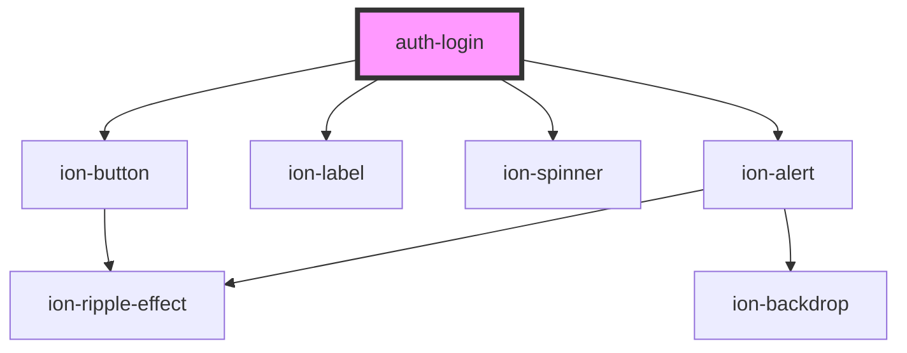

# auth-login

<!-- Auto Generated Below -->

## Properties

| Property      | Attribute      | Description | Type                                                                                                                                                                                                                                                                                                                                                                                     | Default                                                                                                                                                                                                                                                                                                                                                                                                                                                                                                                                                                                                                                                                                                                                                                                                                                                                                                                                                                                                            |
| ------------- | -------------- | ----------- | ---------------------------------------------------------------------------------------------------------------------------------------------------------------------------------------------------------------------------------------------------------------------------------------------------------------------------------------------------------------------------------------- | ------------------------------------------------------------------------------------------------------------------------------------------------------------------------------------------------------------------------------------------------------------------------------------------------------------------------------------------------------------------------------------------------------------------------------------------------------------------------------------------------------------------------------------------------------------------------------------------------------------------------------------------------------------------------------------------------------------------------------------------------------------------------------------------------------------------------------------------------------------------------------------------------------------------------------------------------------------------------------------------------------------------ |
| `resetErrors` | `reset-errors` |             | `number`                                                                                                                                                                                                                                                                                                                                                                                 | `undefined`                                                                                                                                                                                                                                                                                                                                                                                                                                                                                                                                                                                                                                                                                                                                                                                                                                                                                                                                                                                                        |
| `text`        | --             |             | `{ login: string; identifier: { label: string; errors: { required: string; minlen: string; email: string; exists: string; identical: string; noaccountfound: string; notvalid: string; }; }; password: { label: string; forgot: string; errors: { required: string; minlen: string; email: string; exists: string; identical: string; noaccountfound: string; notvalid: string; }; }; }` | `{     login: "Login",     identifier: {       label: "EMail",       errors: {         "required": "E-mail is required",         "minlen": "E-Mail must be at least 4 characters long",         "email": "Email is invalid.",         "exists": "E-Mail already exists.",         "identical": "You cannot add the same e-mail.",         "noaccountfound": "No account found with this email.",         "notvalid": "Invalid account. Check the input for invalid characters."       }     },     password: {       label: "Password",       forgot: "Forgot your password?",       errors: {         "required": "E-mail is required",         "minlen": "E-Mail must be at least 4 characters long",         "email": "Email is invalid.",         "exists": "E-Mail already exists.",         "identical": "You cannot add the same e-mail.",         "noaccountfound": "No account found with this email.",         "notvalid": "Invalid account. Check the input for invalid characters."       }     }   }` |

## Events

| Event           | Description | Type               |
| --------------- | ----------- | ------------------ |
| `loginProgress` |             | `CustomEvent<any>` |
| `loginReset`    |             | `CustomEvent<any>` |
| `loginSuccess`  |             | `CustomEvent<any>` |
| `signUp`        |             | `CustomEvent<any>` |

## Dependencies

### Depends on

- ion-button
- ion-label
- ion-spinner
- ion-alert

### Graph

----------------------------------------------

*Built with [StencilJS](https://stenciljs.com/)*
