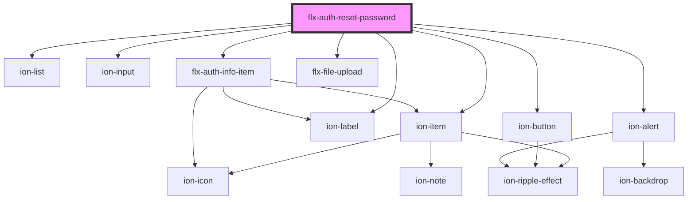

# auth-reset-password

<!-- Auto Generated Below -->

## Properties

| Property           | Attribute           | Description | Type                                                                                                                                                                                                                                                                                                                               | Default |
| ------------------ | ------------------- | ----------- | ---------------------------------------------------------------------------------------------------------------------------------------------------------------------------------------------------------------------------------------------------------------------------------------------------------------------------------- | ------- |
| `confirmationCode` | `confirmation-code` |             | `string`                                                                                                                                                                                                                                                                                                                           | `''`    |
| `i18n`             | --                  |             | `{ retype: { label: string; placeholder: string; errors: { required: string; minlen: string; equal: string; }; }; password: { change: string; label: string; placeholder: string; errors: { required: string; minlen: string; email: string; exists: string; identical: string; noaccountfound: string; notvalid: string; }; }; }` | `i18n`  |
| `userId`           | `user-id`           |             | `string`                                                                                                                                                                                                                                                                                                                           | `''`    |

## Events

| Event          | Description | Type               |
| -------------- | ----------- | ------------------ |
| `resetSubmit`  |             | `CustomEvent<any>` |
| `resetSuccess` |             | `CustomEvent<any>` |

## Methods

### `resetErrors() => Promise<void>`

#### Returns

Type: `Promise<void>`

## Dependencies

### Depends on

- ion-list
- ion-item
- ion-label
- ion-input
- [flx-auth-info-item](../info-item)
- ion-button
- [flx-file-upload](../../file/upload)
- ion-alert

### Graph

----------------------------------------------

*Built with [StencilJS](https://stenciljs.com/)*
