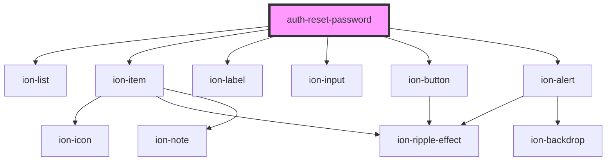

# auth-reset-password

<!-- Auto Generated Below -->

## Properties

| Property           | Attribute           | Description | Type                                                                                                                                                                                                                                                                                                                               | Default                                                                                                                                                                                                                                                                                                                                                                                                                                                                                                                                                                                                                                                                                                                                                                                                                                  |
| ------------------ | ------------------- | ----------- | ---------------------------------------------------------------------------------------------------------------------------------------------------------------------------------------------------------------------------------------------------------------------------------------------------------------------------------- | ---------------------------------------------------------------------------------------------------------------------------------------------------------------------------------------------------------------------------------------------------------------------------------------------------------------------------------------------------------------------------------------------------------------------------------------------------------------------------------------------------------------------------------------------------------------------------------------------------------------------------------------------------------------------------------------------------------------------------------------------------------------------------------------------------------------------------------------- |
| `confirmationCode` | `confirmation-code` |             | `string`                                                                                                                                                                                                                                                                                                                           | `undefined`                                                                                                                                                                                                                                                                                                                                                                                                                                                                                                                                                                                                                                                                                                                                                                                                                              |
| `resetErrors`      | `reset-errors`      |             | `number`                                                                                                                                                                                                                                                                                                                           | `undefined`                                                                                                                                                                                                                                                                                                                                                                                                                                                                                                                                                                                                                                                                                                                                                                                                                              |
| `text`             | --                  |             | `{ retype: { label: string; placeholder: string; errors: { required: string; minlen: string; equal: string; }; }; password: { change: string; label: string; placeholder: string; errors: { required: string; minlen: string; email: string; exists: string; identical: string; noaccountfound: string; notvalid: string; }; }; }` | `{     retype: {       label: "repeat Password",       placeholder: "Re-enter your password",       errors: {         "required": "Password is required.",         "minlen": "Password must be at least 8 characters long.",         "equal": "Password not identical."       }     },     password: {       change: "Change password",       label: "Password",       placeholder: "Your Password",       errors: {         "required": "E-mail is required",         "minlen": "E-Mail must be at least 4 characters long",         "email": "Email is invalid.",         "exists": "E-Mail already exists.",         "identical": "You cannot add the same e-mail.",         "noaccountfound": "No account found with this email.",         "notvalid": "Invalid account. Check the input for invalid characters."       }     }   }` |
| `userId`           | `user-id`           |             | `string`                                                                                                                                                                                                                                                                                                                           | `undefined`                                                                                                                                                                                                                                                                                                                                                                                                                                                                                                                                                                                                                                                                                                                                                                                                                              |

## Events

| Event          | Description | Type               |
| -------------- | ----------- | ------------------ |
| `resetSubmit`  |             | `CustomEvent<any>` |
| `resetSuccess` |             | `CustomEvent<any>` |

## Dependencies

### Depends on

- ion-list
- ion-item
- ion-label
- ion-input
- ion-button
- ion-alert

### Graph

----------------------------------------------

*Built with [StencilJS](https://stenciljs.com/)*
