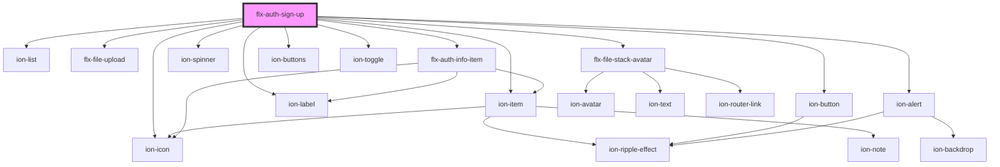

# auth-sign-up

<!-- Auto Generated Below -->

## Properties

| Property       | Attribute       | Description | Type                                                                                                                                                                                                                                                                                                                                                                                                                                                                                                                                                                                                                        | Default                                                    |
| -------------- | --------------- | ----------- | --------------------------------------------------------------------------------------------------------------------------------------------------------------------------------------------------------------------------------------------------------------------------------------------------------------------------------------------------------------------------------------------------------------------------------------------------------------------------------------------------------------------------------------------------------------------------------------------------------------------------- | ---------------------------------------------------------- |
| `avatarUpload` | `avatar-upload` |             | `boolean`                                                                                                                                                                                                                                                                                                                                                                                                                                                                                                                                                                                                                   | `false`                                                    |
| `data`         | --              |             | `IRegister`                                                                                                                                                                                                                                                                                                                                                                                                                                                                                                                                                                                                                 | `{     name: '',     identifier: '',     password: ''   }` |
| `i18n`         | --              |             | `{ signUp: string; confirm: string; name: { label: string; errors: { badword: string; required: string; minlen: string; exists: string; username: string; notvalid: string; alphaspace: string; }; }; identifier: { label: string; confirm: { message: string; button: string; }; errors: { required: string; minlen: string; email: string; exists: string; identical: string; noaccountfound: string; notvalid: string; }; }; password: { label: string; forgot: string; errors: { required: string; minlen: string; email: string; exists: string; identical: string; noaccountfound: string; notvalid: string; }; }; }` | `i18n`                                                     |

## Events

| Event               | Description | Type               |
| ------------------- | ----------- | ------------------ |
| `signUpNotApproved` |             | `CustomEvent<any>` |
| `signUpProgress`    |             | `CustomEvent<any>` |
| `signUpSuccess`     |             | `CustomEvent<any>` |

## Methods

### `resetErrors() => Promise<void>`

#### Returns

Type: `Promise<void>`

## Dependencies

### Depends on

- ion-list
- ion-item
- [flx-file-upload](../../file/upload)
- [flx-file-stack-avatar](../../file/stack-avatar)
- ion-button
- ion-spinner
- ion-icon
- [flx-auth-info-item](../info-item)
- ion-buttons
- ion-toggle
- ion-label
- ion-alert

### Graph

----------------------------------------------

*Built with [StencilJS](https://stenciljs.com/)*
