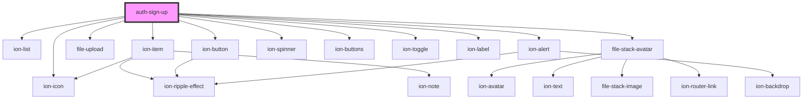

# auth-sign-up

<!-- Auto Generated Below -->

## Properties

| Property       | Attribute       | Description | Type                                                                                                                                                                                                                                                                                                                                                                                                                                                                                                                                                                         | Default                                                                                                                                                                                                                                                                                                                                                                                                                                                                                                                                                                                                                                                                                                                                                                                                                                                                                                                                                                                                                                                                                                                                                                                                                                                                                                                                                                                                                                                                                                                                                                                                               |
| -------------- | --------------- | ----------- | ---------------------------------------------------------------------------------------------------------------------------------------------------------------------------------------------------------------------------------------------------------------------------------------------------------------------------------------------------------------------------------------------------------------------------------------------------------------------------------------------------------------------------------------------------------------------------- | --------------------------------------------------------------------------------------------------------------------------------------------------------------------------------------------------------------------------------------------------------------------------------------------------------------------------------------------------------------------------------------------------------------------------------------------------------------------------------------------------------------------------------------------------------------------------------------------------------------------------------------------------------------------------------------------------------------------------------------------------------------------------------------------------------------------------------------------------------------------------------------------------------------------------------------------------------------------------------------------------------------------------------------------------------------------------------------------------------------------------------------------------------------------------------------------------------------------------------------------------------------------------------------------------------------------------------------------------------------------------------------------------------------------------------------------------------------------------------------------------------------------------------------------------------------------------------------------------------------------- |
| `avatarUpload` | `avatar-upload` |             | `boolean`                                                                                                                                                                                                                                                                                                                                                                                                                                                                                                                                                                    | `undefined`                                                                                                                                                                                                                                                                                                                                                                                                                                                                                                                                                                                                                                                                                                                                                                                                                                                                                                                                                                                                                                                                                                                                                                                                                                                                                                                                                                                                                                                                                                                                                                                                           |
| `data`         | --              |             | `IRegister`                                                                                                                                                                                                                                                                                                                                                                                                                                                                                                                                                                  | `{     name: '',     identifier: '',     password: ''   }`                                                                                                                                                                                                                                                                                                                                                                                                                                                                                                                                                                                                                                                                                                                                                                                                                                                                                                                                                                                                                                                                                                                                                                                                                                                                                                                                                                                                                                                                                                                                                            |
| `resetErrors`  | `reset-errors`  |             | `number`                                                                                                                                                                                                                                                                                                                                                                                                                                                                                                                                                                     | `undefined`                                                                                                                                                                                                                                                                                                                                                                                                                                                                                                                                                                                                                                                                                                                                                                                                                                                                                                                                                                                                                                                                                                                                                                                                                                                                                                                                                                                                                                                                                                                                                                                                           |
| `text`         | --              |             | `{ signUp: string; confirm: string; name: { label: string; errors: { badword: string; required: string; minlen: string; exists: string; username: string; notvalid: string; alphaspace: string; }; }; identifier: { label: string; errors: { required: string; minlen: string; email: string; exists: string; identical: string; noaccountfound: string; notvalid: string; }; }; password: { label: string; forgot: string; errors: { required: string; minlen: string; email: string; exists: string; identical: string; noaccountfound: string; notvalid: string; }; }; }` | `{     signUp: "Create account",     confirm: "You confirm that you are agree the T&Cs and the Privacy Policy.",     name: {       label: "Name",       errors: {         "badword": "This name contains invalid terms",         "required": "Name is required.",         "minlen": "The name must be at least 3 characters long.",         "exists": "This name already exists.",         "username": "The name may contain only a-z, A-Z, 0-9, -, _",         "notvalid": "Invalid name. Check the input for invalid characters",         "alphaspace": "Your name may only contain letters and spaces."       }     },     identifier: {       label: "EMail",       errors: {         "required": "E-mail is required",         "minlen": "E-Mail must be at least 4 characters long",         "email": "Email is invalid.",         "exists": "E-Mail already exists.",         "identical": "You cannot add the same e-mail.",         "noaccountfound": "No account found with this email.",         "notvalid": "Invalid account. Check the input for invalid characters."       }     },     password: {       label: "Password",       forgot: "Forgot your password?",       errors: {         "required": "E-mail is required",         "minlen": "E-Mail must be at least 4 characters long",         "email": "Email is invalid.",         "exists": "E-Mail already exists.",         "identical": "You cannot add the same e-mail.",         "noaccountfound": "No account found with this email.",         "notvalid": "Invalid account. Check the input for invalid characters."       }     }   }` |

## Events

| Event               | Description | Type               |
| ------------------- | ----------- | ------------------ |
| `signUpNotApproved` |             | `CustomEvent<any>` |
| `signUpProgress`    |             | `CustomEvent<any>` |
| `signUpSuccess`     |             | `CustomEvent<any>` |

## Dependencies

### Depends on

- ion-list
- ion-item
- [file-upload](../../file/upload)
- [file-stack-avatar](../../file/stack-avatar)
- ion-button
- ion-spinner
- ion-icon
- ion-buttons
- ion-toggle
- ion-label
- ion-alert

### Graph

----------------------------------------------

*Built with [StencilJS](https://stenciljs.com/)*
