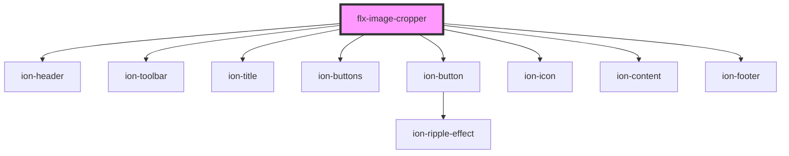

# flx-image-cropper

<!-- Auto Generated Below -->

## Properties

| Property            | Attribute              | Description | Type                                                               | Default                                     |
| ------------------- | ---------------------- | ----------- | ------------------------------------------------------------------ | ------------------------------------------- |
| `boundary`          | --                     |             | `null`                                                             | `null`                                      |
| `displayFooter`     | `display-footer`       |             | `boolean`                                                          | `true`                                      |
| `displayHeader`     | `display-header`       |             | `boolean`                                                          | `true`                                      |
| `displayIonContent` | `display-ion-content`  |             | `boolean`                                                          | `true`                                      |
| `enableResize`      | `enable-resize`        |             | `boolean`                                                          | `false`                                     |
| `enableZoom`        | `enable-zoom`          |             | `boolean`                                                          | `true`                                      |
| `enforceBoundary`   | `enforce-boundary`     |             | `boolean`                                                          | `true`                                      |
| `file`              | --                     |             | `Blob \| undefined`                                                | `undefined`                                 |
| `minZoomImageWidth` | `min-zoom-image-width` |             | `boolean`                                                          | `false`                                     |
| `orientation`       | `orientation`          |             | `number \| undefined`                                              | `undefined`                                 |
| `viewPort`          | --                     |             | `{ width: number; height: number; type?: CropType \| undefined; }` | `{width: 300, height: 300, type: 'circle'}` |

## Events

| Event        | Description | Type               |
| ------------ | ----------- | ------------------ |
| `updateCrop` |             | `CustomEvent<any>` |

## Methods

### `getBlob() => Promise<void>`

#### Returns

Type: `Promise<void>`

## Dependencies

### Depends on

- ion-header
- ion-toolbar
- ion-title
- ion-buttons
- ion-button
- ion-icon
- ion-content
- ion-footer

### Graph

----------------------------------------------

*Built with [StencilJS](https://stenciljs.com/)*
