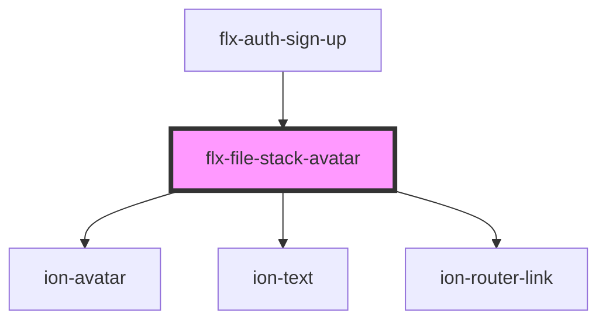

# file-stack-avatar

<!-- Auto Generated Below -->

## Properties

| Property      | Attribute     | Description | Type                  | Default                               |
| ------------- | ------------- | ----------- | --------------------- | ------------------------------------- |
| `avatar`      | --            |             | `IAvatar \| null`     | `null`                                |
| `background`  | `background`  |             | `any`                 | `'var(--ion-color-primary, #3880ff)'` |
| `color`       | `color`       |             | `any`                 | `'#ffffff'`                           |
| `ext`         | `ext`         |             | `string`              | `'jpg'`                               |
| `height`      | `height`      |             | `number`              | `200`                                 |
| `imgTitle`    | `img-title`   |             | `string`              | `''`                                  |
| `link`        | `link`        |             | `string \| undefined` | `undefined`                           |
| `name`        | `name`        |             | `string`              | `''`                                  |
| `placeholder` | `placeholder` |             | `null \| string`      | `null`                                |
| `width`       | `width`       |             | `number`              | `200`                                 |

## Dependencies

### Used by

 - [flx-auth-sign-up](../../auth/sign-up)

### Depends on

- ion-avatar
- ion-text
- ion-router-link

### Graph

----------------------------------------------

*Built with [StencilJS](https://stenciljs.com/)*
