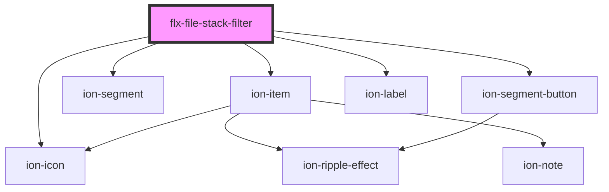

# file-stack-filter

<!-- Auto Generated Below -->

## Properties

| Property | Attribute | Description | Type        | Default |
| -------- | --------- | ----------- | ----------- | ------- |
| `filter` | --        |             | `IFilter[]` | `[]`    |

## Events

| Event          | Description | Type               |
| -------------- | ----------- | ------------------ |
| `changeFilter` |             | `CustomEvent<any>` |

## Dependencies

### Depends on

- ion-item
- ion-segment
- ion-segment-button
- ion-label
- ion-icon

### Graph

----------------------------------------------

*Built with [StencilJS](https://stenciljs.com/)*
