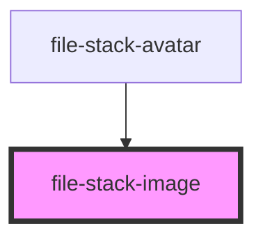

# file-stack-image

<!-- Auto Generated Below -->

## Properties

| Property           | Attribute            | Description | Type                                      | Default                                |
| ------------------ | -------------------- | ----------- | ----------------------------------------- | -------------------------------------- |
| `autoAspectRatio`  | `auto-aspect-ratio`  |             | `boolean`                                 | `true`                                 |
| `ext`              | `ext`                |             | `string`                                  | `'jpg'`                                |
| `fileStack`        | --                   |             | `IFileStack`                              | `undefined`                            |
| `fileStackSize`    | --                   |             | `{ size: string; pixelRatio: string; }[]` | `[{size: '340xxx', pixelRatio: '1x'}]` |
| `placeholder`      | `placeholder`        |             | `string`                                  | `null`                                 |
| `rootElement`      | --                   |             | `HTMLElement`                             | `undefined`                            |
| `trackViewTimeout` | `track-view-timeout` |             | `any`                                     | `null`                                 |

## Events

| Event            | Description | Type               |
| ---------------- | ----------- | ------------------ |
| `trackViewImage` |             | `CustomEvent<any>` |

## Dependencies

### Used by

 - [file-stack-avatar](../stack-avatar)

### Graph

----------------------------------------------

*Built with [StencilJS](https://stenciljs.com/)*
