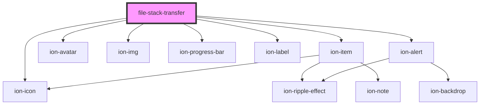

# file-stack-transfer

<!-- Auto Generated Below -->

## Properties

| Property  | Attribute | Description | Type    | Default     |
| --------- | --------- | ----------- | ------- | ----------- |
| `account` | --        |             | `IUser` | `undefined` |

## Events

| Event            | Description | Type               |
| ---------------- | ----------- | ------------------ |
| `uploadFinished` |             | `CustomEvent<any>` |

## Methods

### `openUploadMenu() => Promise<any>`

#### Returns

Type: `Promise<any>`

## Dependencies

### Depends on

- ion-item
- ion-avatar
- ion-img
- ion-icon
- ion-progress-bar
- ion-label
- ion-alert

### Graph

----------------------------------------------

*Built with [StencilJS](https://stenciljs.com/)*
