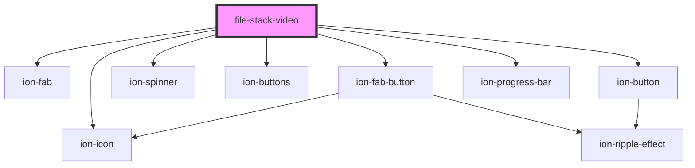

# file-stack-video

<!-- Auto Generated Below -->

## Properties

| Property           | Attribute            | Description | Type          | Default      |
| ------------------ | -------------------- | ----------- | ------------- | ------------ |
| `autoAspectRatio`  | `auto-aspect-ratio`  |             | `boolean`     | `true`       |
| `autoPlayVideo`    | `auto-play-video`    |             | `boolean`     | `true`       |
| `fileStack`        | --                   |             | `IFileStack`  | `null`       |
| `fullScreenButton` | `full-screen-button` |             | `boolean`     | `true`       |
| `loopVideo`        | `loop-video`         |             | `boolean`     | `true`       |
| `muteButton`       | `mute-button`        |             | `boolean`     | `false`      |
| `mutedVideo`       | `muted-video`        |             | `boolean`     | `true`       |
| `onlyPreview`      | `only-preview`       |             | `boolean`     | `false`      |
| `preload`          | `preload`            |             | `string`      | `'metadata'` |
| `rootElement`      | --                   |             | `HTMLElement` | `undefined`  |
| `showControls`     | `show-controls`      |             | `boolean`     | `false`      |
| `srcVideo`         | `src-video`          |             | `string`      | `null`       |
| `trackViewTimeout` | `track-view-timeout` |             | `any`         | `null`       |
| `volume`           | `volume`             |             | `number`      | `0.7`        |

## Events

| Event            | Description | Type               |
| ---------------- | ----------- | ------------------ |
| `trackViewVideo` |             | `CustomEvent<any>` |

## Methods

### `switchMuteState() => Promise<void>`

#### Returns

Type: `Promise<void>`

## Dependencies

### Depends on

- ion-fab
- ion-fab-button
- ion-icon
- ion-spinner
- ion-buttons
- ion-button
- ion-progress-bar

### Graph

----------------------------------------------

*Built with [StencilJS](https://stenciljs.com/)*
