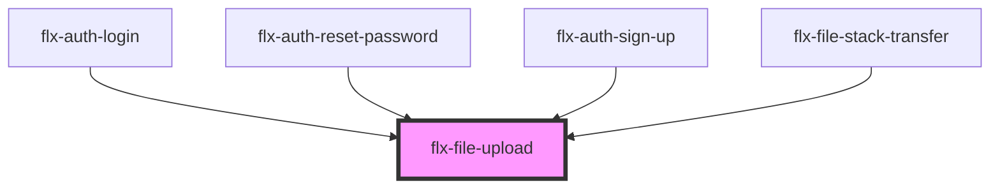

# file-upload

<!-- Auto Generated Below -->

## Properties

| Property   | Attribute  | Description | Type      | Default     |
| ---------- | ---------- | ----------- | --------- | ----------- |
| `accept`   | `accept`   |             | `string`  | `"image/*"` |
| `capture`  | --         |             | `null`    | `null`      |
| `multiple` | `multiple` |             | `boolean` | `false`     |

## Events

| Event      | Description | Type               |
| ---------- | ----------- | ------------------ |
| `selected` |             | `CustomEvent<any>` |

## Methods

### `select() => Promise<void>`

#### Returns

Type: `Promise<void>`

## Dependencies

### Used by

 - [flx-auth-login](../../auth/login)
 - [flx-auth-reset-password](../../auth/reset-password)
 - [flx-auth-sign-up](../../auth/sign-up)
 - [flx-file-stack-transfer](../stack-transfer)

### Graph

----------------------------------------------

*Built with [StencilJS](https://stenciljs.com/)*
